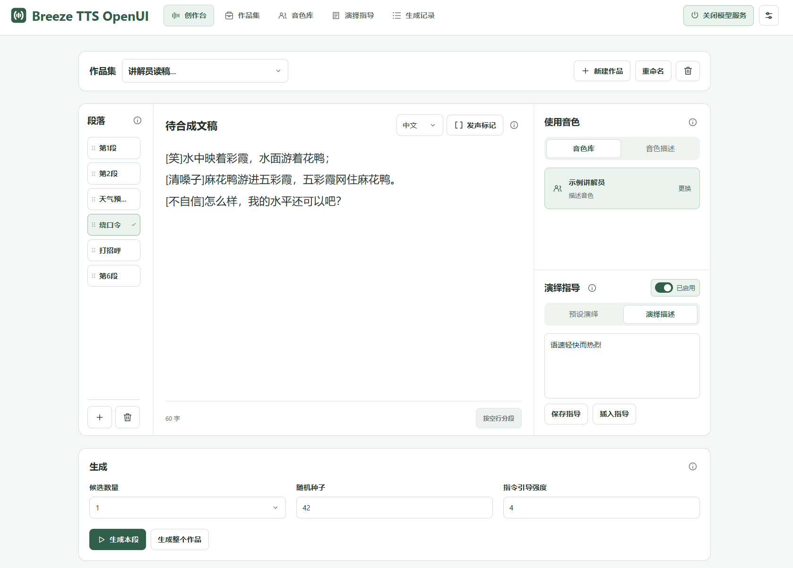
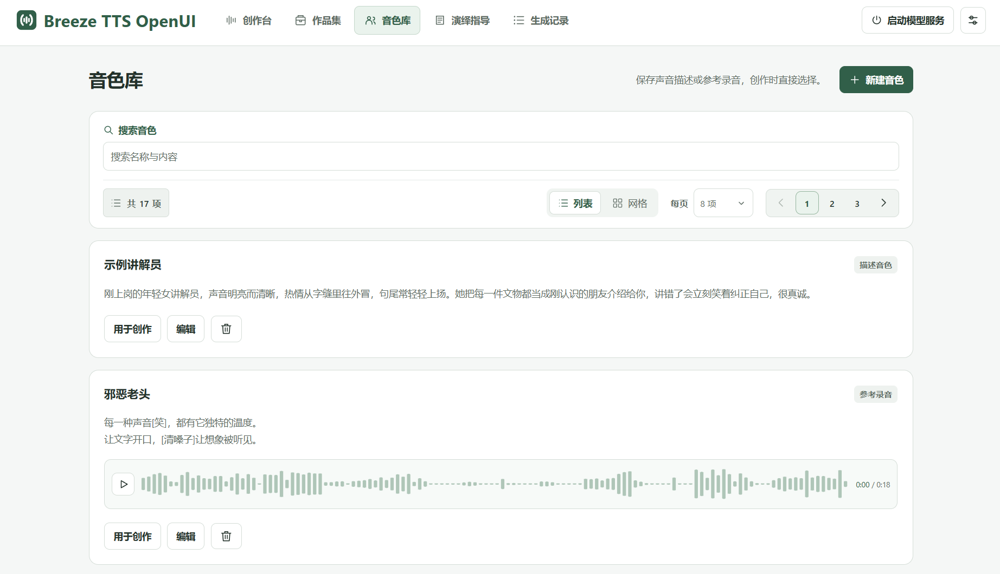
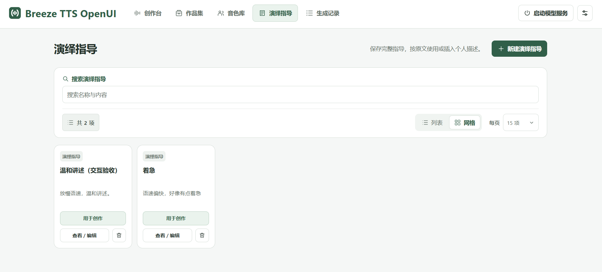
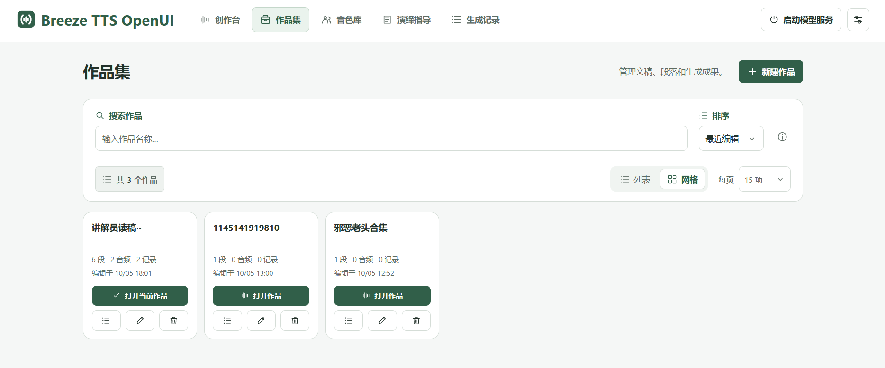
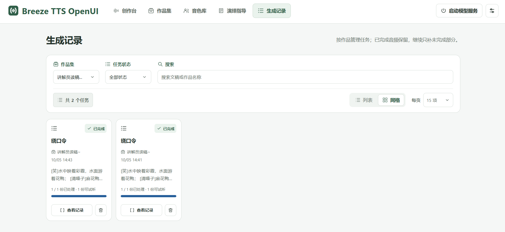
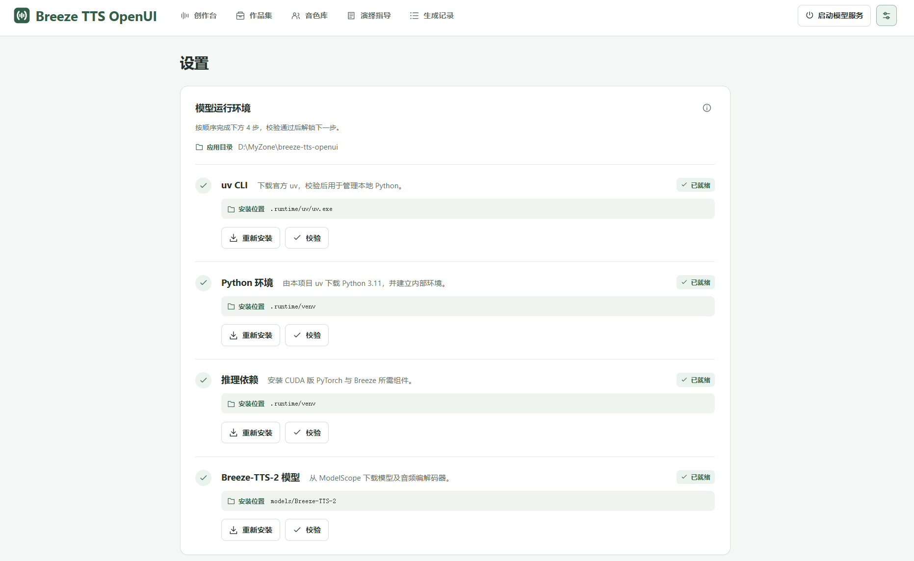

<div align="center">


<p> Breeze-TTS-OpenUI </p>
</div>

# Breeze-TTS-OpenUI

基于 [Breeze-TTS-2](https://www.modelscope.cn/models/BreezeBlue/Breeze-TTS-2) 模型的独立社区扩展应用，
为创作者提供 **文本转语音、音色克隆、音色描述与演绎指导**和**产出管理**，
探索模型在 **角色扮演与同伴、语音代理、游戏、有声书与有声剧、直播、播客** 等场景中的应用。

## 使用

在项目 **Releases** 页面下载免安装 ZIP，解压后使用。

- **仅支持 Windows 10/11。**
- **显卡显存需 8 GB 及以上。**

## 界面与试听

<a href="assets/ForDocs/创作台.png">
  
</a>

### 音频示例 · 绕口令

[试听／下载示例音频（WAV）](assets/ForDocs/绕口令test.wav?raw=true)

```text
[笑]水中映着彩霞，水面游着花鸭；
[清嗓子]麻花鸭游进五彩霞，五彩霞网住麻花鸭。
[不自信]怎么样，我的水平还可以吧？
```
> 如果README中无法试听，可以自行下载`assets/ForDocs/绕口令test.wav` 进行试听
<details>
<summary>查看更多界面</summary>

<table>
  <tr>
    <th width="50%">音色库</th>
    <th width="50%">演绎指导</th>
  </tr>
  <tr>
    <td valign="top">
      <a href="assets/ForDocs/音色库.png"></a>
    </td>
    <td valign="top">
      <a href="assets/ForDocs/演绎指导.png"></a>
    </td>
  </tr>
  <tr>
    <th>作品集</th>
    <th>生成记录</th>
  </tr>
  <tr>
    <td valign="top">
      <a href="assets/ForDocs/作品集.png"></a>
    </td>
    <td valign="top">
      <a href="assets/ForDocs/生成记录.png"></a>
    </td>
  </tr>
</table>

<p><strong>设置 · 模型运行环境</strong></p>
<a href="assets/ForDocs/image.png"></a>

</details>

## 开发

需要 Windows 与 Node.js 24+。克隆仓库后安装依赖，启动开发客户端：

```powershell
git clone https://github.com/persist-1/Breeze-TTS-OpenUI.git
cd Breeze-TTS-OpenUI
$env:electron_config_cache = "$PWD\.runtime\cache\electron"
npm install --cache .runtime/cache/npm
npm run dev
```

运行环境与模型通过应用设置安装。双击 `一键打包.cmd` 制作免安装 ZIP；代码结构见 [架构说明](docs/ARCHITECTURE.md)。

## 许可

应用代码与原创图标采用 [Apache-2.0](LICENSE)。模型及自托管生成结果遵守官方 [研究与非商业协议](MODEL_LICENSE)，商业使用需另获书面授权；本项目不代表模型官方。
